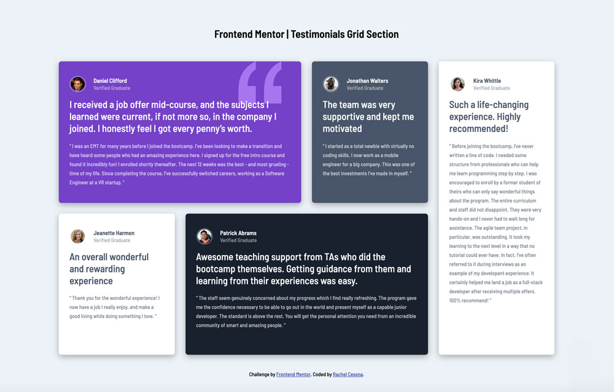
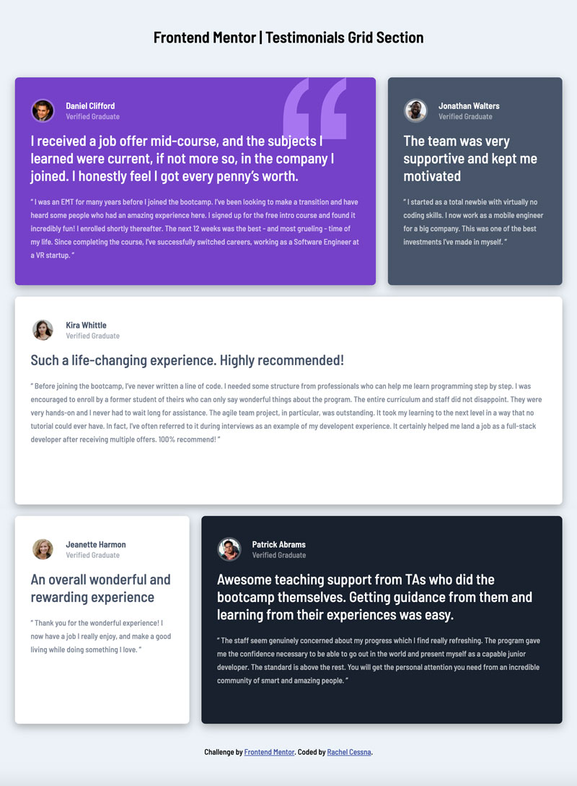

# Frontend Mentor - Testimonials grid section solution

This is a solution to the [Testimonials grid section challenge on Frontend Mentor](https://www.frontendmentor.io/challenges/testimonials-grid-section-Nnw6J7Un7). Frontend Mentor challenges help you improve your coding skills by building realistic projects. 

## Table of contents

- [Overview](#overview)
  - [The challenge](#the-challenge)
  - [Screenshot](#screenshot)
  - [Links](#links)
- [My process](#my-process)
  - [Built with](#built-with)
  - [What I learned](#what-i-learned)
  - [Useful resources](#useful-resources)
- [Author](#author)

## Overview

### The challenge

Users should be able to:

- View the optimal layout for the site depending on their device's screen size

### Screenshot

#### Desktop Layout

#### Tablet Layout

#### Mobile Layout

### Links

- Solution URL: [GitHub Repo](https://github.com/cessnar516/FM-testimonials-grid-section)
- Live Site URL: [Github Pages](https://cessnar516.github.io/FM-testimonials-grid-section/)

## My process

### Built with

- Semantic HTML5 markup
- SASS
- Flexbox
- CSS Grid
- Mobile-first workflow

### What I learned

I used a combination of Flexbox and CSS Grid to complete this challenge. The body element is a flex container with `flex-direction: column` and `align-items: center` used to center all the content on the page. Flexbox is also used to align the images and headings inside of each card. The testimonial cards are surrounded by a containing `
` with a class of "testimonials". This `
` is the grid container for the project and has `grid-template-rows` and `grid-template-columns` applied. The settings for the rows and columns are changed using media query breakpoints. 

The mobile layout is displayed in one column and `grid-gap` is used to provide spacing between the cards, and the desktop layout uses four columns and two rows. I also decided to add a tablet layout using 3 columns and 3 rows so the cards are presented in a visually pleasing way no matter what size screen they're viewed on.

Semantic HTML elements are used to markup the page. The `<h1>` and testimonials are located inside the `<main>` element, and the attribution informaiton is located inside of the `<footer>` element. Each card is marked up as an `<article>` and given an `aria-label` for accessibility purposes. 

### Useful resources

- [CSS Tricks - A Complete Guide to Flexbox](https://css-tricks.com/snippets/css/a-guide-to-flexbox/) - This website has great information about using Flexbox, including lots of code examples and illustrations.
- [CSS Tricks - A Complete Guide to CSS Grid](https://css-tricks.com/snippets/css/complete-guide-grid/) - This is another great resource from CSS Tricks that explains CSS Grid.

## Author

- LinkedIn - [Rachel Cessna](https://www.linkedin.com/in/rachelacessna/)
- Frontend Mentor - [@cessnar516](https://www.frontendmentor.io/profile/cessnar516)
- CodePen - [@cessnar](https://codepen.io/cessnar)
